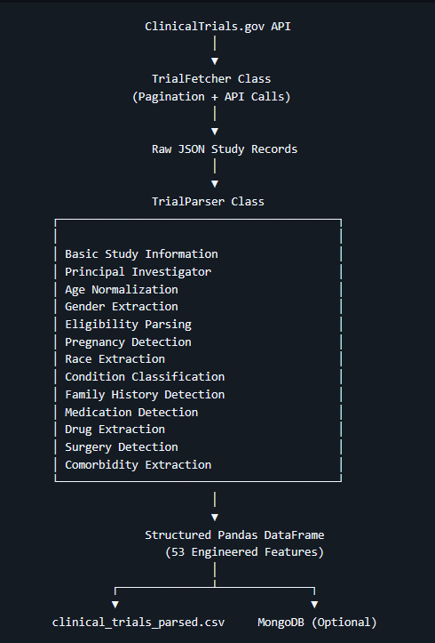
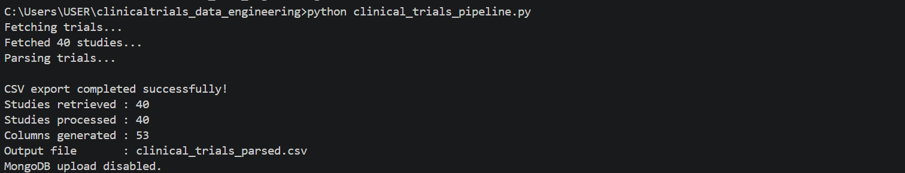
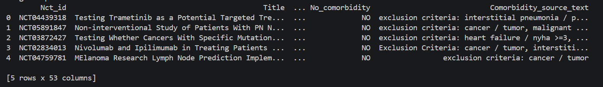

# ClinicalTrials.gov Neurofibromatosis Eligibility Intelligence Pipeline


## Table of Contents

- [Overview](#overview)
- [Objectives](#objectives)
- [Pipeline Architecture](#pipeline-architecture)
- [Technology Stack](#technology-stack)
- [Key Features](#key-features)
- [Skills Demonstrated](#skills-demonstrated)
- [Project Workflow](#project-workflow)
- [Project Structure](#project-structure)
- [Sample Output](#sample-output)
- [Data Dictionary](#data-dictionary)
- [Installation](#installation)
- [Future Improvements](#future-improvements)
- [Usage](#usage)

## Overview

A Python-based data engineering pipeline that extracts, transforms, and structures Neurofibromatosis clinical trial data from the ClinicalTrials.gov API into analysis-ready datasets.

The project demonstrates an end-to-end ETL workflow, including automated data extraction, JSON parsing, data normalization, eligibility criteria processing, demographic feature extraction, and structured data storage. The resulting datasets are designed to support healthcare research, patient matching, diversity analysis, and downstream analytics.

**Organization:** Health and Wellness Foundation, Inc. (Volunteer Project)

## Objectives

The project was developed to:

- Automate retrieval of Neurofibromatosis clinical trial data.
- Transform complex API responses into structured datasets.
- Standardize demographic and eligibility information.
- Support healthcare research and patient-matching initiatives.
- Demonstrate practical data engineering techniques using Python.

## Pipeline Architecture



## Technology Stack

| Category | Technologies |
|----------|--------------|
| Programming Language | Python |
| Data Source | ClinicalTrials.gov API |
| Database | MongoDB |
| Data Processing | Pandas |
| Data Format | JSON |
| Version Control | Git, GitHub |

## Key Features

- **Automated Data Retrieval** – Extracts Neurofibromatosis clinical trial records directly from the ClinicalTrials.gov API.

- **API Pagination** – Retrieves complete datasets across multiple API pages.

- **JSON Parsing** – Converts complex nested API responses into structured records.

- **Eligibility Processing** – Extracts participant eligibility criteria into analysis-ready fields.

- **Demographic Extraction** – Standardizes age, sex, and participant characteristics.

- **Data Normalization** – Cleans and standardizes inconsistent source values.

- **MongoDB Integration** – Stores processed records for flexible querying and downstream applications.

- **Analysis-Ready Dataset** – Produces structured datasets suitable for healthcare analytics and patient-matching workflows.

## Skills Demonstrated

### Data Engineering

- ETL pipeline development
- Data transformation
- Data normalization
- Data validation

### Data Acquisition

- REST API integration
- JSON processing
- API pagination

### Database

- MongoDB
- Document database design

### Programming

- Python
- Pandas

## Workflow Description

1. Retrieve clinical trial data from the ClinicalTrials.gov API.

2. Parse nested JSON responses into structured records.

3. Normalize demographic and eligibility information.

4. Export the processed records as a structured CSV dataset.

5. Optionally upload the processed records to MongoDB if configured.

## Project Structure
```text
clinicaltrials-data-engineering/
├── clinical_trials_pipeline.py
├── clinical_trials_parsed.csv
├── requirements.txt
├── README.md
└── images/
```
## Engineered Dataset Preview

The pipeline transforms complex, nested ClinicalTrials.gov API responses into a structured dataset containing **53 analysis-ready features**.

### Console Output



### Preview of the engineered dataset.



The complete dataset also includes structured fields for principal investigators, institutions, demographic eligibility, race mentions, family history, medication use, surgical procedures, and comorbidity extraction.

## Data Dictionary

The pipeline enriches raw ClinicalTrials.gov data by transforming unstructured eligibility criteria into structured, analysis-ready features.

| Field                      | Description                                                                                                 |
| -------------------------- | ----------------------------------------------------------------------------------------------------------- |
| `Age_range`                | Normalized participant age range derived from minimum and maximum eligibility ages.                         |
| `Pregnancy_reason`         | Indicates whether pregnancy is explicitly included, excluded, or not mentioned in the eligibility criteria. |
| `Race_reason`              | Context extracted from eligibility text to identify race or ethnicity-related inclusion criteria.           |
| `Neurofibromatosis Type 1` | Indicates whether the study specifically targets Neurofibromatosis Type 1 (NF1).                            |
| `Neurofibromatosis Type 2` | Indicates whether the study specifically targets Neurofibromatosis Type 2 (NF2).                            |
| `Schwannomatosis`          | Identifies studies involving Schwannomatosis.                                                               |
| `Under_Investigation`      | Flags studies where Neurofibromatosis-related conditions are described as investigational.                  |
| `Family_source_text`       | Extracted eligibility text referencing family history or affected relatives.                                |
| `Medication_source_text`   | Captures medication-related eligibility requirements from the study criteria.                               |
| `Drug_source_text`         | Lists therapeutic agents identified within the eligibility text.                                            |
| `Surgery_source_text`      | Captures references to surgical procedures relevant to study eligibility.                                   |
| `Comorbidity_source_text`  | Identifies medical conditions detected within the exclusion criteria.                                       |

## Installation
```bash
git clone https://github.com/stu99a/clinicaltrials-data-engineering.git
cd clinicaltrials-data-engineering
pip install -r requirements.txt
python clinical_trials_pipeline.py
```
## Future Improvements

- Add support for additional disease conditions.
- Export to PostgreSQL in addition to MongoDB.
- Package the parser as a reusable Python library.
- Schedule automatic data refreshes with GitHub Actions.
- Add unit tests for parsing functions.
- Containerize the pipeline with Docker.

## Usage

Run the pipeline to retrieve the latest active Neurofibromatosis clinical trials and generate a structured CSV dataset.

```bash
python clinical_trials_pipeline.py
```

The pipeline will:

- Retrieve studies from the ClinicalTrials.gov API.
- Parse and normalize eligibility criteria.
- Generate a structured dataset (`clinical_trials_parsed.csv`).
- Optionally upload records to MongoDB if configured.

## License

This project is licensed under the MIT License.
