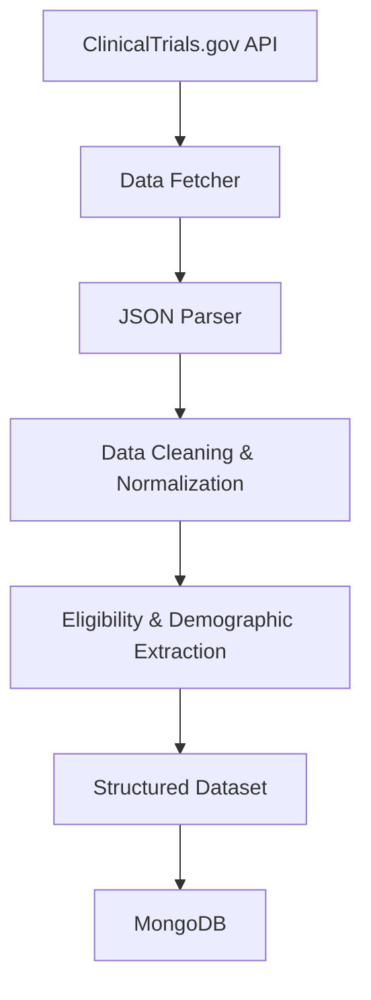

# ClinicalTrials.gov Neurofibromatosis ETL Pipeline

## Table of Contents

- [Overview](#overview)
- [Objectives](#objectives)
- [Pipeline Architecture](#pipeline-architecture)
- [Technology Stack](#technology-stack)
- [Key Features](#key-features)
- [Skills Demonstrated](#skills-demonstrated)
- [Project Workflow](#project-workflow)
- [Project Structure](#project-structure)
- [Sample Output](#sample-output)
- [Installation](#installation)
- [Usage](#usage)
- [Future Improvements](#future-improvements)

## Overview

### ClinicalTrials.gov Neurofibromatosis Data Engineering Pipeline

A Python-based data engineering pipeline that extracts, transforms, and structures Neurofibromatosis clinical trial data from the ClinicalTrials.gov API into analysis-ready datasets.

The project demonstrates an end-to-end ETL workflow, including automated data extraction, JSON parsing, data normalization, eligibility criteria processing, demographic feature extraction, and structured data storage. The resulting datasets are designed to support healthcare research, patient matching, diversity analysis, and downstream analytics.

**Organization:** Health and Wellness Foundation, Inc. (Volunteer Project)

## Objectives

The project was developed to:

- Automate retrieval of Neurofibromatosis clinical trial data.
- Transform complex API responses into structured datasets.
- Standardize demographic and eligibility information.
- Support healthcare research and patient-matching initiatives.
- Demonstrate practical data engineering techniques using Python.

## Pipeline Architecture

The pipeline automates the retrieval and transformation of Neurofibromatosis clinical trial data from the ClinicalTrials.gov API. Raw JSON responses are parsed, cleaned, and normalized before extracting eligibility criteria and demographic attributes. The processed data is then stored in MongoDB, producing structured datasets suitable for healthcare research, patient matching, and downstream analytics.

## Technology Stack

| Category | Technologies |
|----------|--------------|
| Programming Language | Python |
| Data Source | ClinicalTrials.gov API |
| Database | MongoDB |
| Data Processing | Pandas |
| Data Format | JSON |
| Version Control | Git, GitHub |

## Key Features

- **Automated Data Retrieval** – Extracts Neurofibromatosis clinical trial records directly from the ClinicalTrials.gov API.

- **API Pagination** – Retrieves complete datasets across multiple API pages.

- **JSON Parsing** – Converts complex nested API responses into structured records.

- **Eligibility Processing** – Extracts participant eligibility criteria into analysis-ready fields.

- **Demographic Extraction** – Standardizes age, sex, and participant characteristics.

- **Data Normalization** – Cleans and standardizes inconsistent source values.

- **MongoDB Integration** – Stores processed records for flexible querying and downstream applications.

- **Research-Ready Output** – Produces structured datasets suitable for healthcare analytics and patient-matching workflows.

## Skills Demonstrated

### Data Engineering

- ETL pipeline development
- Data transformation
- Data normalization
- Data validation

### Data Acquisition

- REST API integration
- JSON processing
- API pagination

### Database

- MongoDB
- Document database design

### Programming

- Python
- Pandas
## Workflow Description

1. Retrieve clinical trial data from the ClinicalTrials.gov API.

2. Parse nested JSON responses into structured records.

3. Normalize demographic and eligibility information.

4. Store processed records in MongoDB.

5. Export structured datasets for downstream analytics and healthcare research.
