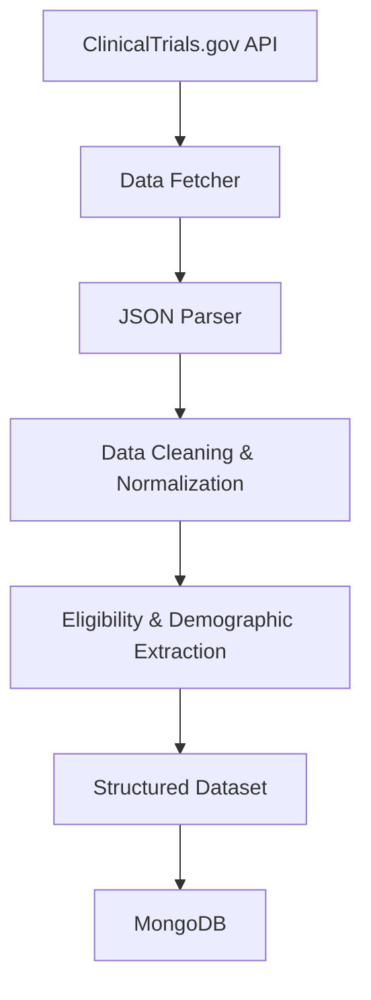

# ClinicalTrials.gov Neurofibromatosis Data Engineering

## Table of Contents

- Project Overview
- Objectives
- Pipeline Architecture
- Technology Stack
- Features
- Workflow
- Project Structure
- Sample Output
- Installation
- Usage
- Future Improvements

## Overview

# ClinicalTrials.gov Neurofibromatosis Data Engineering Pipeline

A Python-based data engineering pipeline that extracts, transforms, and structures Neurofibromatosis clinical trial data from the ClinicalTrials.gov API into analysis-ready datasets.

The project demonstrates an end-to-end ETL workflow, including automated data extraction, JSON parsing, data normalization, eligibility criteria processing, demographic feature extraction, and structured data storage. The resulting datasets are designed to support healthcare research, patient matching, diversity analysis, and downstream analytics.

**Organization:** Health and Wellness Foundation, Inc. (Volunteer Project)

## Objectives

The project was developed to:

- Automate retrieval of Neurofibromatosis clinical trial data.
- Transform complex API responses into structured datasets.
- Standardize demographic and eligibility information.
- Support healthcare research and patient-matching initiatives.
- Demonstrate practical data engineering techniques using Python.

## Pipeline Architecture

The pipeline automates the retrieval and transformation of Neurofibromatosis clinical trial data from the ClinicalTrials.gov API. Raw JSON responses are parsed, cleaned, and normalized before extracting eligibility criteria and demographic attributes. The processed data is then stored in MongoDB, producing structured datasets suitable for healthcare research, patient matching, and downstream analytics.

## Technology Stack

| Category | Technologies |
|----------|--------------|
| Programming Language | Python |
| Data Source | ClinicalTrials.gov API |
| Database | MongoDB |
| Data Processing | Pandas |
| Data Format | JSON |
| Version Control | Git, GitHub |

## Key Features

- Automated clinical trial data extraction
- API pagination handling
- Eligibility criteria parsing
- Demographic data extraction
- Data normalization and cleaning
- MongoDB integration
- Research-ready dataset generation

## Skills Demonstrated

- Data Engineering
- API Integration
- Data Transformation
- Healthcare Data Processing
- MongoDB
- Python Programming
- Data Cleaning

## Project Workflow

ClinicalTrials.gov API  
↓  
Data Extraction  
↓  
Data Cleaning & Normalization  
↓  
Eligibility & Demographic Processing  
↓  
MongoDB Storage  
↓  
Research-Ready Dataset

This project transformed complex clinical trial data into structured datasets suitable for healthcare research, patient matching, diversity analysis, and analytics applications.
